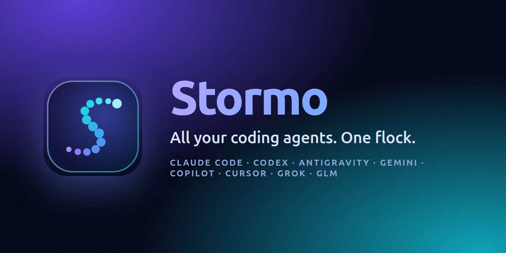
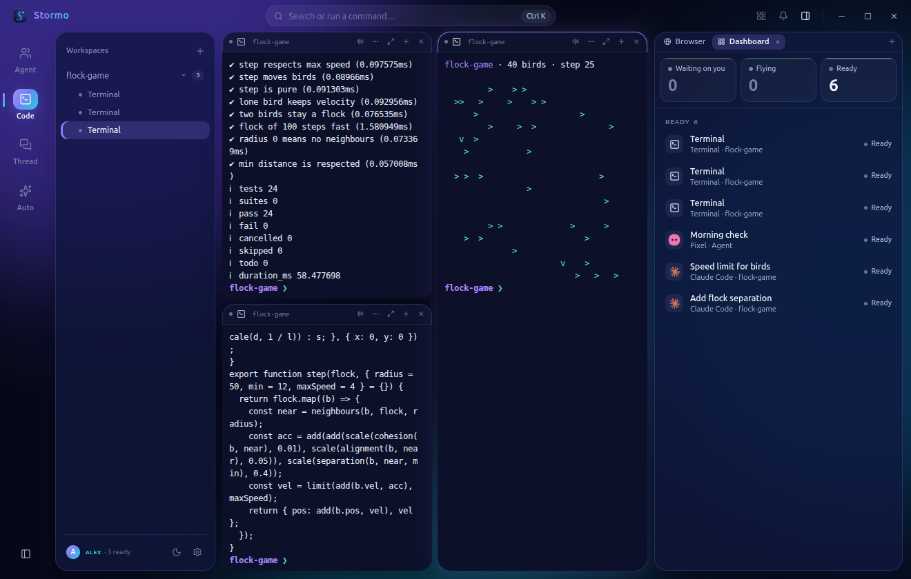
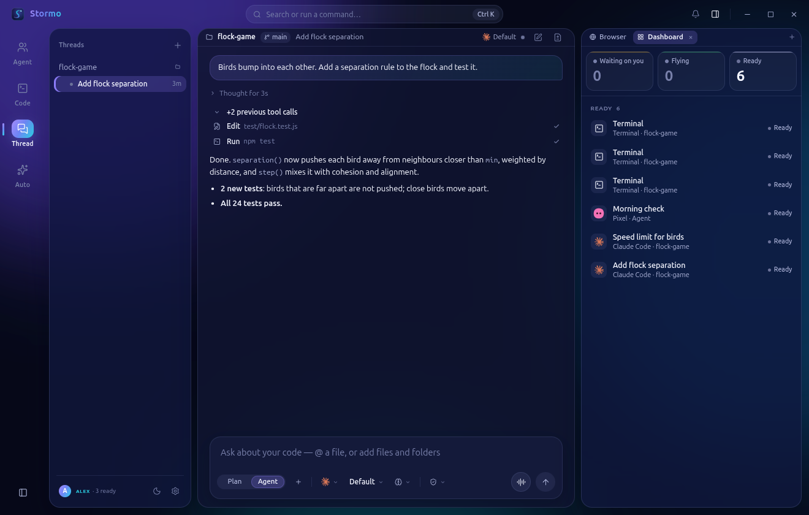
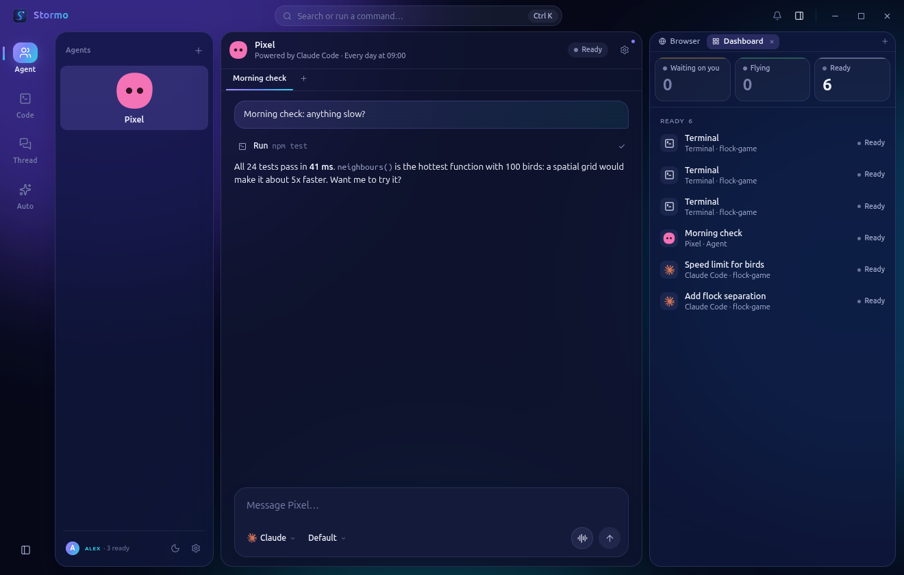
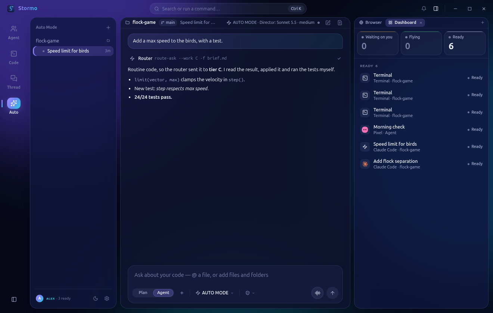
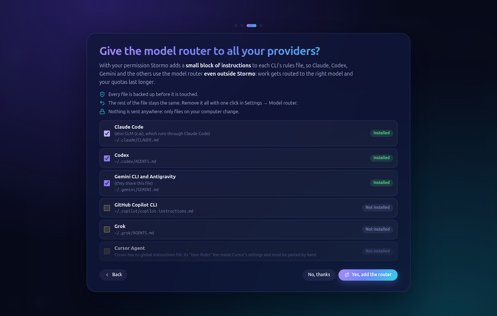

<p align="center">
  
</p>

<p align="center">
  <a href="https://github.com/francescoquirino/stormo/releases/latest"></a>
  
  
  
  <a href="https://github.com/francescoquirino/stormo/stargazers"></a>
</p>

**Claude Code, Codex, Antigravity, Gemini CLI, GitHub Copilot, Cursor Agent, Grok and GLM — in one desktop
workspace, with real terminals and the subscriptions you already pay for.** No API keys. No middleman. No extra bill.

<p align="center">
  
</p>
<p align="center">
  ▶ <a href="https://github.com/francescoquirino/stormo/releases/latest">Watch the 30-second trailer</a> &nbsp;·&nbsp;
  ⬇ <a href="https://github.com/francescoquirino/stormo/releases/latest">Download for Linux</a>
</p>

## Why Stormo?

Every AI lab now ships a great coding CLI. Each one lives in its own window, with its own quota, and none of them
knows the others exist. Stormo puts the whole flock in one place:

- 🪶 **One workspace, every agent.** Open a folder, launch any CLI next to any other, in a grid, columns, rows or focus.
- 🖥️ **Real terminals, not a wrapper.** The actual CLIs run with *your* login. What you see is what they do.
- 🧭 **A model router that respects your quotas.** Design with the strongest model, write routine code with the cheapest,
  review with a second one — automatically, across all your subscriptions, without burning one window dry.
- 💬 **Threads and teammates.** Read an agent's work like a chat, approve risky steps, give named agents a brief,
  a folder and a daily routine.
- 🔒 **Local and private.** No server, no telemetry, no account. Your data stays in your home folder.

## What's inside

| | |
|---|---|
| **Code** — real terminals side by side, one folder, any agent<br><br> | **Thread** — a coding conversation over your folder, with approvals<br><br> |
| **Agent** — named teammates with a brief, a folder, chats and routines<br><br> | **Auto Mode** — a director model that routes the coding work for you<br><br> |

Plus a **dashboard** of every running agent (waiting on you / flying / ready), a built-in **browser** for your
localhost app, a **command bar** (Ctrl+K), notifications, light and dark themes, and local **voice dictation**
(Whisper, offline — it fills the prompt, you always press Enter yourself).

## The model router

The router sends each task to the right tier and balances the quotas of the providers you are signed in to:

| Tier | Models | Job |
|---|---|---|
| **A** | Opus 5.5 (native or via Antigravity) | Design and task breakdown |
| **B** | Sonnet 5.5, GPT-6.1 Sol, Haiku 5.5 as fallback | Complex code, review, final fixes |
| **C** | Free local models (if running), GPT-6 Luna, GLM-5.3 Flash | Routine code |

**BC** work means a C model writes and a single B model reviews — at most two returns, never an endless loop.
A review is not a test: Stormo's director reads, applies and verifies the real files.

Auto Mode menu: **AUTO** (pick the class automatically) · **HIGH** (A, design only) · **MEDIUM** (B) · **LOW** (C) · **BC**.

<p align="center"></p>

With one click Stormo can also give the router to **every CLI outside the app**: it adds a small, clearly marked block
to each CLI's global rules file (`~/.claude/CLAUDE.md`, `~/.codex/AGENTS.md`, `~/.gemini/GEMINI.md`, Copilot, Grok…),
backs the file up first, never touches the rest, and removes it again from Settings. Cursor has no global rules
file, so Stormo tells you to paste the rules by hand.

## Quick start (Linux x64)

```bash
curl -LO https://github.com/francescoquirino/stormo/releases/latest/download/Stormo-1.0.0-linux-x64.tar.gz
tar xzf Stormo-1.0.0-linux-x64.tar.gz
./Stormo-linux-x64/Stormo
```

> **Ubuntu 24.04+** (and other distros that restrict unprivileged user namespaces): Electron's sandbox needs the
> `chrome-sandbox` helper to be setuid root. Either install the **`.deb`** from the release, which takes care of it
> (`sudo apt install ./stormo_1.0.0_amd64.deb`), or for the portable build run once:
> `sudo chown root:root Stormo-linux-x64/chrome-sandbox && sudo chmod 4755 Stormo-linux-x64/chrome-sandbox`.
> Stormo tells you this itself if it cannot start. It never disables the sandbox.

On first launch: the trailer plays (skippable), Stormo shows which CLIs it found and how to sign in or install the
missing ones, then asks whether to give the model router to your providers. You can replay the setup anytime from
**Settings**.

Install the CLIs you want from their official sources and sign in once; Stormo picks them up from `PATH`,
`~/.local/bin`, `~/.npm-global/bin` and nvm. For the router: `python3 resources/app/assets/router/setup.py`
(from the extracted folder) installs `route-ask` into `~/.local/bin`.

## Build from source

```bash
git clone https://github.com/francescoquirino/stormo.git
cd stormo
npm ci
npm start                     # run
npm test                      # 150 tests
node tools/pack-linux.mjs     # portable build in dist/
```

Requires Node.js 20+. Windows packaging scripts are included (`tools/pack.mjs`, needs
[`rcedit.exe`](https://github.com/electron/rcedit/releases) in `tools/`) but are not tested yet — PRs welcome.

## Privacy

Stormo has no server and no telemetry. Workspaces, chats and settings live in `~/.config/Stormo`. API-key
environment variables are stripped before a CLI is launched, so every agent uses its own subscription login.
The router only talks to the providers you use; for GLM it reads your z.ai key from `~/.zai/env` and never
stores or prints it.

## Roadmap

- [ ] Windows and macOS builds
- [ ] Configurable local-model list for tier C
- [ ] More providers as their CLIs ship

Ideas and bug reports: [open an issue](https://github.com/francescoquirino/stormo/issues).
If Stormo saves you a window or two, a ⭐ helps other people find it.

## Credits & license

[MIT](LICENSE). Icons by [Lucide](https://lucide.dev) (ISC) and [Lobe Icons](https://github.com/lobehub/lobe-icons) (MIT),
terminals by [xterm.js](https://xtermjs.org) (MIT), built with [Electron](https://www.electronjs.org).
Product names and logos of the supported CLIs belong to their owners; Stormo is not affiliated with any of them.
